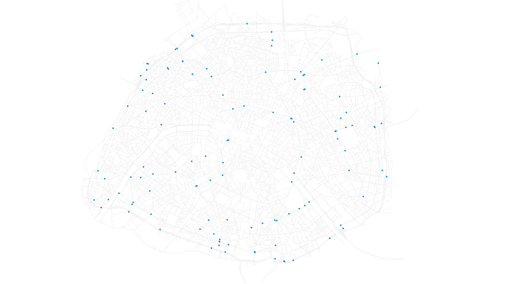

# eqasim renderer

This is a tool to visualize quickly MATSim or eqasim simulation results. It is
heavily work-in-progress, so don't expect too much for the time being. One started,
the tool will read a network and an events file and then draw the visualisation
on the screen. The colors and contents of the visualisation can be defined through
a configuration file. In parallel, the tool will write out every rendered frame
into a folder. Afterwards, these independent images can be combined to a video
using external tools.

## Example

To see an example, have a look at the `example` folder. It contains a output
network file and an events file of an eqasim simulation for Paris. Furthermore,
the folder contains `paris.json`, which defines the visualisation. Besides
general settings (video size, speed, ...) it defines *one* network layer (making
use of all links with car traffic), and *one* vehicles layer (without any
further specifications, so it will apply to all vehicles by default). Note that
you can define different colors for different network layers and vehicle layers,
and also sizes for the latter. Have a look at the `config` package in the code
to see which options for filtering are available.

The visualisation can be started by calling `RunVisualisation` with `paris.json`
as the only argument in side of the `example` folder. You may start the script
from Eclipse/IntelliJ or create a jar by calling

```bash
mvn package
java -cp /path/to/renderer-*.jar RunVisualisation paris.json
```

As defined in the configuration file, the video will be created in the `video_output`
folder. As it does not exist yet, *you* must create it before calling the script.

After that, the script can be called and the images will be created in `video_output`.
You may use the images as they are or combine them to a video. For that, you can,
for instance, use `ffmpeg` like so inside the `video_output` folder:

```bash
ffmpeg -framerate 25 -i video_%d.png -c:v libx264 -profile:v high -crf 20 -pix_fmt yuv420p output.mp4
```

An example output can be seen in `example/output.mp4`.



## Video output

As of November 2021, the renderer can also produce videos directly. For that, add the `outputFormat` option to the configuration file and set it to `Video`. The output path will then be interpreted as a path to a video file and the video will be created at this place.

